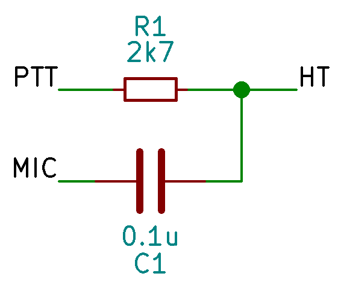
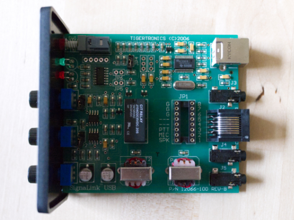
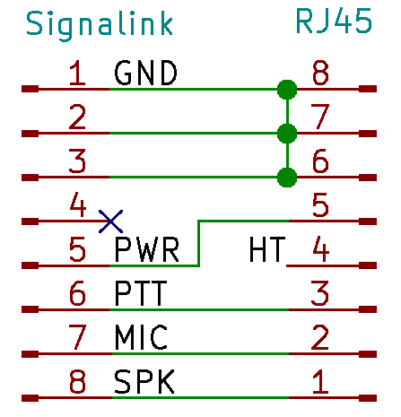
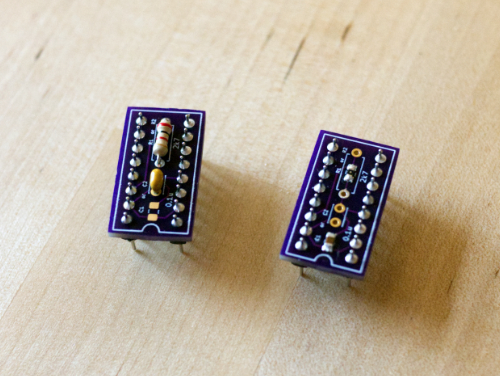
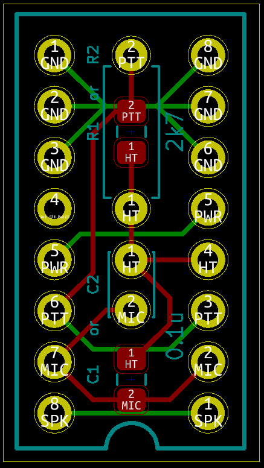
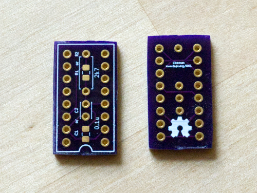
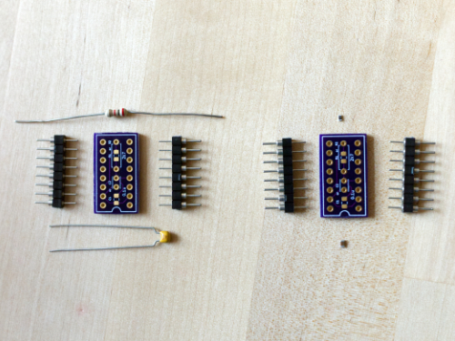
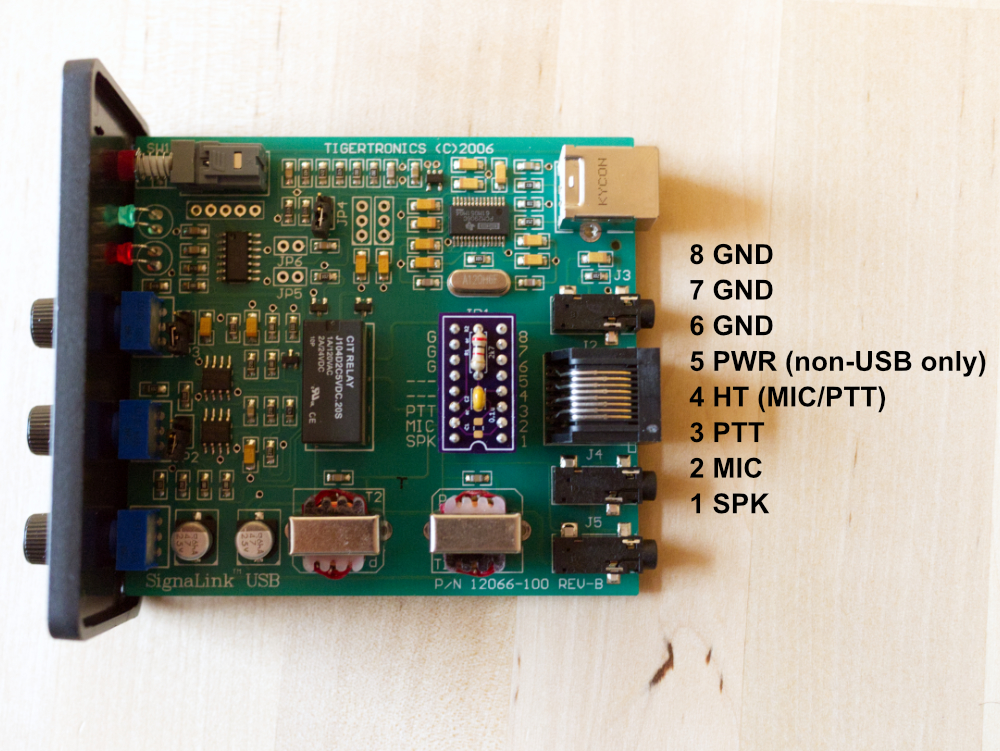

# SignaLink Universal Jumper Module
 The SignaLink Universal Jumper Module is a DIY accessory for the Tigertronics SignaLink amateur radio sound card. The jumper includes all of the circuit components needed to connect handheld radios with a combined MIC/PTT line, and it provides a consistent pinout for building custom cables. 
 
 The module is licensed under the TAPR Open Hardware License [www.tapr.org/OHL](http://www.tapr.org/OHL). 

# Narrative
The SignaLink by Tigertronics is a popular and convenient USB sound card for amateur radio. It has a user-configurable RJ-45 connector for interfacing with many different systems. Users change the connector pinout to suit their radio and cable. See the Tigertronics [Wiring Information](http://www.tigertronics.com/sl_wirebm.htm) and [Detailed Jumper Installation Procedure](http://www.tigertronics.com/files/signalink_jumper_procedure.pdf). 

When used with a single radio - especially a radio with an RJ-45 input - Tigertronics' instructions are simple and effective. Users also have the option of purchasing a turnkey solution with pre-installed jumper and custom cable. 

Homebrewers or amateurs with multiple radios, however, may find themselves needing to change configurations often. Opening the SignaLink case can be inconvenient. Further, interfacing with handheld radios - which may have a combination MIC/PTT line - adds complexity because of the extra circuit components. 

The Universal Jumper has two main purposes:
1. It includes all of the circuitry needed to interface with combined MIC/PTT handheld radios and it passes through MIC and PTT signals separately. 
2. It provides a consistent pinout for users who need to design custom cables anyway. 

The Universal Jumper is likely not useful for amateurs with a single radio configuration or who change configurations infrequently. 

I designed the Universal Jumper to work with my Yaesu VX-3 and uBitx, so that I can switch between the two just by changing the cable. 

If indeed this is a problem that needs solving, there are certainly other ways to solve it. This jumper is a solution that works for me; and it was a fun, simple project to design and build. I'm sharing it here with the hope that it helps you, too.  

This project is provided as-is and without any warranty, in accordance with its license. You are responsible for verifying that the jumper will work with your radios and cables. 

# Design
## MIC/PTT Interface
The main element in the design is the interface to handheld radios, which have a combination MIC/PTT line, in contrast to the separate lines used by mobile and base station radios. 

In simple terms, MIC can be considered AC and the PTT DC. One solution to separate the two is an RC-type filter, or, expressed differently, a DC-blocking capacitor and a current-limiting resistor. Tigertronics provides a reference circuit on their [website](http://www.tigertronics.com/sl_wireht_comb.htm) which addresses this type of connection. 

 <b>MIC/PTT Interface</b>

Component values can also be adjusted to accommodate a particular radio or in general; values within the same order or magnitude should work similarly. 

## SignaLink Interface
Inside the enclosure, an 8x2 rounded pin DIP socket sits between the SignaLink circuitry and the RJ-45 external connector. 

 <b>SignaLink PCB Showing JP1 Socket for Universal Jumper</b>

The socket can be used with off-the-shelf jumper modules or hand wired by the end user. The Universal Jumper will also fit into this socket, using standard 0.1-inch pitch rounded pins, with the two rows separated by 0.3 inches. 

 <b>SignaLink Interface and Passthrough</b>

The universal jumper passes all signals - SPK, MIC, and PTT - through to the RJ45 in addition to routing them to the HT interface circuit. The universal jumper also passes through PWR to support the legacy SignaLink SL-1+ (non-USB). 

# Build

 <b>Completed Build, THT and SMD Versions</b>

## Schematic
The schematic consists of both of the above elements, plus an additional set of resistor and capacitor which allow the user to choose a through hole or surface mount assembly on the same PCB. 

The schematic is available as a [PDF](kicad/pdf/schematic.pdf) in this folder and as part of the KiCAD project. 

## PCB

The jumper PCB accommodates both through hole and surface mount components and provides the correct spacing to interface with the SignaLink. 

 <b>PCB Design in KiCAD</b>

The PCB can also be ordered using the KiCAD project files or included gerbers from a number of manufacturers, including OshPark, where the prototypes were made. [Click here](https://oshpark.com/shared_projects/eV0r6j4w) to easily order the PCBs from OshPark. 

 <b>Unpopulated Boards from OshPark</b>

The jumper can also be constructed without a PCB by using standard 0.1-inch spaced perfboard. Place the J1 and J2 connectors 0.3 inches apart; that is, there are two rows between the connectors.

## BOM
To make the project more usable for the community, the PCB offers a choice between surface mount and through hole is designed to work with spare parts to the extent possible. **Populate only one capacitor and one resistor.** 

Similar values and packages may be substituted. Always verify that the chosen values are compatible with the connected radio prior to power on. The example build below uses approximate values and packages, namely 2kOhm resistors and one 0603 SMD package. 

 <b>SMD and THT Versions Ready to Build</b>

In case components need to be purchased, the included [BOM_surface-mount.csv](bom/BOM_surface-mount.csv) and [BOM_through-hole.csv](bom/BOM_through-hole.csv) give examples of acceptable parts. Either can be imported into DigiKey. 

Reference | Quantity | Value | Package
--------- | -------: | ----: | ----
J1, J2 | 2 | 0.018-inch diameter Rounded Header Pin | 0.1-inch, 1x8-position
C1 | 0 or 1 | 0.1u | SMD, 0805
R1 | 0 or 1 | 2.7k | SMD, 0805
C2 | 0 or 1 | 0.1u | THT Radial, 2.5mm pitch
R2 | 0 or 1 | 2.7k | THT Axial, 6.3mm max.

**Note in particular that J1 and J2 must use round pin headers - square headers will damage the SignaLink.**

## Cabling
**Custom cables are required.** Standard RJ-45 terminated CAT5 cables are unlikely to be compatible with any radio. Cables purchased from Tigertronics are also not compatible. Refer to the radio manual and the reference below for pinouts for building cables. 

# Reference

 <b>Installed Jumper with Pinout Reference</b>

# Known Issues

**Silkscreen Text** The license URL on the back of the board is too small. 

